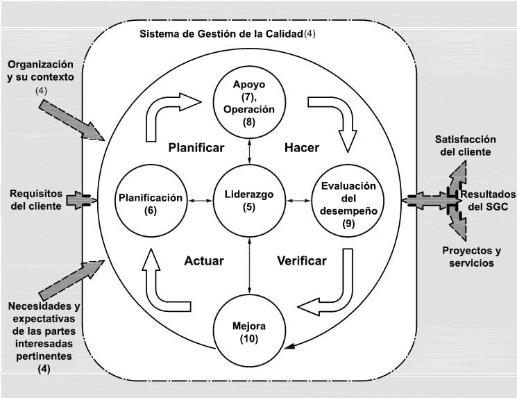
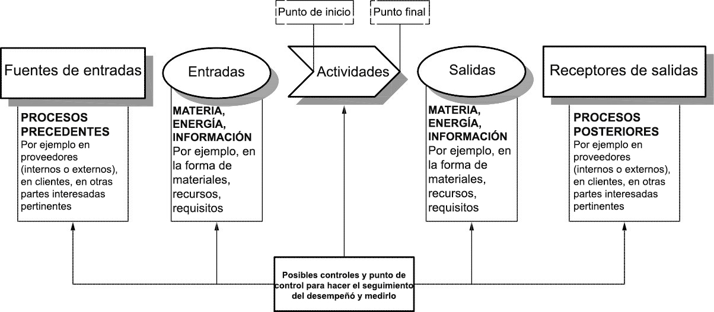

# Contexto de la organización

Contexto de la organización

4.1 Conocimiento de la organización y de su contexto
La organización debe determinar las cuestiones externas e internas que son pertinentes para su
propósito y su dirección estratégica y que afectan a su capacidad para lograr los resultados previstos de
su sistema de gestión de la calidad.
La organización debe realizar el seguimiento y la revisión de la información sobre estas cuestiones
externas e internas.
NOTA 1 Las cuestiones pueden incluir factores positivos y negativos o condiciones para su consideración.
NOTA 2 La comprensión del contexto externo puede verse facilitado al considerar cuestiones que surgen de los
entornos legal, tecnológico, competitivo, de mercado, cultural, social y económico, ya sea internacional, nacional,
regional o local.

NOTA 3 La comprensión del contexto interno puede verse facilitada al considerar cuestiones relativas a los valores,
la cultura, los conocimientos y el desempeño de la organización

4.2 Comprensión de las necesidades y expectativas de las partes interesadas
Debido a su efecto o efecto potencial en la capacidad de la organización de proporcionar regularmente
productos y servicios que satisfagan los requisitos del cliente y los legales y reglamentarios aplicables, la
organización debe determinar:
a) las partes interesadas que son pertinentes al sistema de gestión de la calidad;
b) los requisitos pertinentes de estas partes interesadas para el sistema de gestión de la calidad.
La organización debe realizar el seguimiento y la revisión de la información sobre estas partes
interesadas y sus requisitos pertinentes.

4.3 Determinación del alcance del sistema de gestión de la calidad
La organización debe determinar los límites y la aplicabilidad del sistema de gestión de la calidad para
establecer su alcance.
Cuando se determina este alcance, la organización debe considerar:
a) las cuestiones externas e internas referidas en el apartado 4.1;
b) los requisitos de las partes interesadas pertinentes indicados en el apartado 4.2;
c) los productos y servicios de la organización.
La organización debe aplicar todos los requisitos dé está Norma Internacional si son aplicables en el
alcance determinado de su sistema de gestión de la calidad.
El alcance del sistema de gestión de la calidad de la organización debe estar disponible y mantenerse
como información documentada. El alcance debe establecer los tipos de productos y servicios cubiertos, y
proporcionar la justificación para cualquier requisito de esta Norma Internacional que la organización
determine que no es aplicable para el alcance de su sistema de gestión de la calidad.
La conformidad con esta Norma Internacional sólo se puede declarar si los requisitos determinados como
no aplicables no afectan a la capacidad o a la responsabilidad de la organización de asegurarse de la
conformidad de sus productos y servicios y del aumento de la satisfacción del cliente.

4.4 Sistema de gestión de la calidad y sus procesos
4.4.1 La organización debe establecer, implementar, mantener y mejorar continuamente un sistema de
gestión de la calidad, incluidos los procesos necesarios y sus interacciones, de acuerdo con los requisitos
de esta Norma Internacional.
La organización debe determinar los procesos necesarios para el sistema de gestión de la calidad y su
aplicación a través de la organización, y debe:
a) determinar las entradas requeridas y las salidas esperadas de estos procesos;
b) determinar la secuencia e interacción de estos procesos;

c) determinar y aplicar los criterios y los métodos (incluyendo el seguimiento, las mediciones y los
indicadores del desempeño relacionados) necesarios para asegurarse de la operación eficaz y el
control de estos procesos;
d) determinar los recursos necesarios para estos procesos y asegurarse de su disponibilidad;
e) asignar las responsabilidades y autoridades para estos procesos;
f)

abordar los riesgos y oportunidades determinados de acuerdo con los requisitos del apartado 6.1:

g) evaluar estos procesos e implementar cualquier cambio necesario para asegurarse de que estos
procesos logran los resultados previstos;
h) mejorar los procesos y el sistema de gestión de la calidad.
4.4.2 En la medida en que sea necesario, la organización debe:
a) mantener información documentada para apoyar la operación de sus procesos;
b) conservar la información documentada para tener la confianza de que los procesos se realizan según
lo planificado.

---

---

