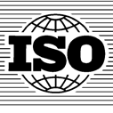

# Prólogo

Prólogo
ISO (Organización Internacional de Normalización) es una federación mundial de organismos
nacionales de normalización (organismos miembros de ISO). El trabajo de preparación de las normas
internacionales normalmente se realiza a través de los comités técnicos de ISO. Cada organismo
miembro interesado en una materia para la cual se haya establecido un comité técnico; tiene el
derecho de estar representado en dicho comité. Las organizaciones internacionales, públicas y
privadas, en coordinación con ISO, también participan en el trabajo. ISO colabora estrechamente con
la Comisión Electrotécnica Internacional (IEC) en todas las materias de normalización electrotécnica.
En la parte 1 de las Directivas IS0/IEC se describen los procedimientos utilizados para desarrollar esta
norma y para su mantenimiento posterior. En particular deberla tomarse nota de los diferentes criterios
de aprobación necesarios para los distintos tipos de documentos ISO. Esta norma se redactó de
acuerdo con las reglas editoriales de la parte 2 de las Directivas ISO/IEC (véase
www.iso.org/directives).
Se llama la atención sobre la posibilidad de que algunos de los elementos de este documento puedan
estar sujetos a derechos de patente. ISO no asume la responsabilidad por la identificación de
cualquiera o todos los derechos de patente. Los detalles sobre cualquier derecho de patente
identificado durante el desarrollo de esta norma se indican en la introducción y/o en la lista ISO de
declaraciones de patente recibidas (véase www.iso.org/patents).
Cualquier nombre comercial utilizado en esta norma es información que se proporciona para
comodidad del usuario y no constituye una recomendación.
Para obtener una explicación sobre el significado de los términos específicos de ISO y expresiones
relacionadas con la evaluación de la conformidad, así como información de la adhesión de ISO a los
principios de la Organización Mundial del Comercio (OMC) respecto a los Obstáculos Técnicos al
Comercio (OTC), véase la siguiente dirección: http://www.iso.org/iso/fnrewnrd.htm.
El comité responsable de esta norma es el ISO/TC 176, Gestión y aseguramiento de la calidad,
Subcomité SC 2, Sistemas de la calidad.
Esta quinta edición anula y sustituye a la cuarta edición (Norma ISO 9001:2008), que ha sido revisada
técnicamente, mediante la adopción de una secuencia de capítulos revisados y la adaptación de los
principios de gestión de la calidad revisados y de nuevos conceptos. También anula y sustituye al
Corrigendum Técnico ISO 9001:2008/Cor.l:2009.

Prólogo de la versión en español
Esta Norma Internacional ha sido traducida por el Grupo de Trabajo Spanish Translation Task
Force (STTF) del Comité Técnico ISO/TC 176, Gestión y aseguramiento de la calidad, en el que
participan representantes de los organismos nacionales de normalización y representantes del
sector empresarial de los siguientes países:
Argentina, Bolivia, Brasil, Chile, Colombia, Costa Rica, Cuba, Ecuador, España, Estados Unidos
de América, México, Perú, República Dominicana, Uruguay y Venezuela.
Igualmente, en el citado Grupo de Trabajo participan representantes de COPANT (Comisión
Panamericana de Normas Técnicas) y de INLAC (Instituto Latinoamericano de Aseguramiento de
la Calidad).
Esta traducción es parte del resultado del trabajo que el Grupo ISO/TC 176 STTG viene desarrollando
desde su creación en el año 1999 para lograr la unificación de la terminología en lengua española en el
ámbito de la gestión de la calidad.

---

